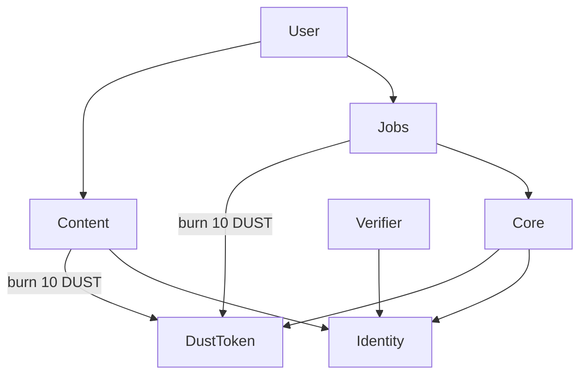

User flow (plain terms):
1) Join: Identity entry auto-updated when rewards happen.
2) Post: call Content.mintPost → burns 10 DUST → increments posts.
3) Job: poster createJob (burn fee) → worker apply/submit → poster approve → Core.rewardJob.
4) Reward: backend/operator calls Core.rewardSocial/Job to add trust score and mint DUST.
5) Verification: external proof via Verifier sets tier in Identity.

Blockchain interaction simplified:
- One token (DUST).
- Identity as a user table.
- Core as reward service.
- Content/Jobs as feature modules that call Core/Identity.
